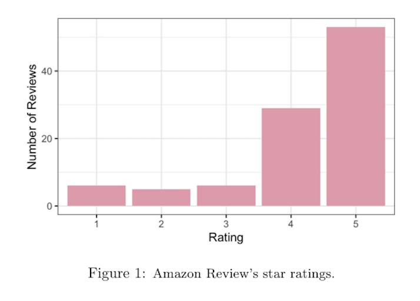
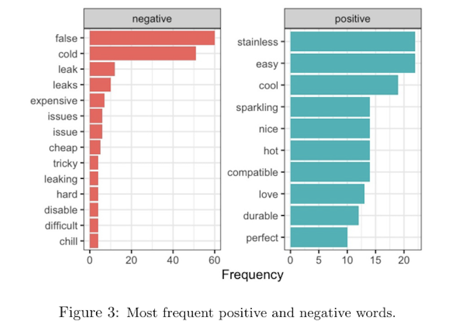

# Amazon Reviews Text Mining & Sentiment Analysis


An end-to-end **Natural Language Processing (NLP)** project developed in **R** to automatically collect, preprocess and analyse Amazon UK customer reviews using multiple sentiment analysis techniques.

---

# Project Overview

Online marketplaces contain thousands of customer reviews that provide valuable information about consumer satisfaction. However, manually analysing this volume of textual data is inefficient and difficult to scale.

This project develops an automated **NLP pipeline** capable of collecting Amazon UK reviews, preprocessing textual data and comparing different sentiment analysis approaches.

The project was developed as part of the **Text Mining and Sentiment Analysis** course at the **University of Bergamo**.

---

# Research Question

> **Which sentiment analysis approach performs best on Amazon UK customer reviews?**

The objective is to compare different Natural Language Processing techniques and evaluate their strengths and limitations on a real-world dataset.

---

# Project Workflow

```text
Amazon UK Reviews
        │
        ▼
Web Scraping
(RSelenium + rvest)
        │
        ▼
Text Cleaning & Preprocessing
        │
        ▼
Sentiment Analysis
├── Bing Lexicon
├── UDPipe
└── Naive Bayes
        │
        ▼
Performance Comparison
```

---

# Technologies

| Category | Tools |
|----------|-------|
| Programming | R |
| Web Scraping | RSelenium, rvest |
| Data Manipulation | tidyverse, stringr |
| NLP | tidytext, UDPipe |
| Machine Learning | quanteda, quanteda.textmodels |
| Visualization | ggplot2 |

---

# Results

## Rating Distribution



The product received predominantly positive feedback, with an average rating of **4.18/5** and **53%** of reviews assigned the maximum score.

---

## Most Frequent Words


Word frequency analysis highlights the product's most discussed characteristics, including its ability to keep beverages cold and maintain carbonation.

---

## Positive and Negative Words



Dictionary-based sentiment analysis revealed an important limitation: words such as **"cold"** were classified as negative despite representing one of the product's main strengths. Context-aware approaches significantly reduced this issue.

---

# Key Findings

- Average customer rating: **4.18 / 5**
- **53%** of reviews received a **5-star** rating.
- **UDPipe Context** and **Naive Bayes** achieved the highest classification accuracy (**0.857**).
- Dictionary-based sentiment analysis suffers from contextual limitations on domain-specific datasets.
- Context-aware NLP methods improve sentiment classification performance.

---

# Skills Demonstrated

- Web Scraping
- Natural Language Processing (NLP)
- Text Preprocessing
- Sentiment Analysis
- Supervised Machine Learning
- Model Evaluation
- Data Visualization
- Comparative Model Analysis

---

# Repository Structure

```text
amazon-reviews-sentiment-analysis/
│
├── README.md
├── R/
│   └── analysis.R
├── figures/
│   ├── ratings_distribution.png
│   ├── top_words.png
│   └── sentiment_words.png
└── report/
    └── Amazon_Text_Mining_Report.pdf
```

---

# Project Report

The complete report describing the methodology, implementation and discussion of the results is available here:

📄 **[Amazon Text Mining Report](report/Amazon_Text_Mining_Report.pdf)**

---

# What I Learned

Through this project I gained practical experience in:

- Building an end-to-end NLP pipeline in R.
- Collecting real-world data through automated web scraping.
- Comparing lexicon-based, context-aware and supervised sentiment analysis techniques.
- Evaluating model performance using quantitative metrics.
- Understanding the importance of linguistic context in sentiment classification.
- Translating unstructured textual data into actionable business insights.

---

# Authors

- **Daniela Budu**
- Lucrezia Boroni
- Nicole Vigani

University of Bergamo